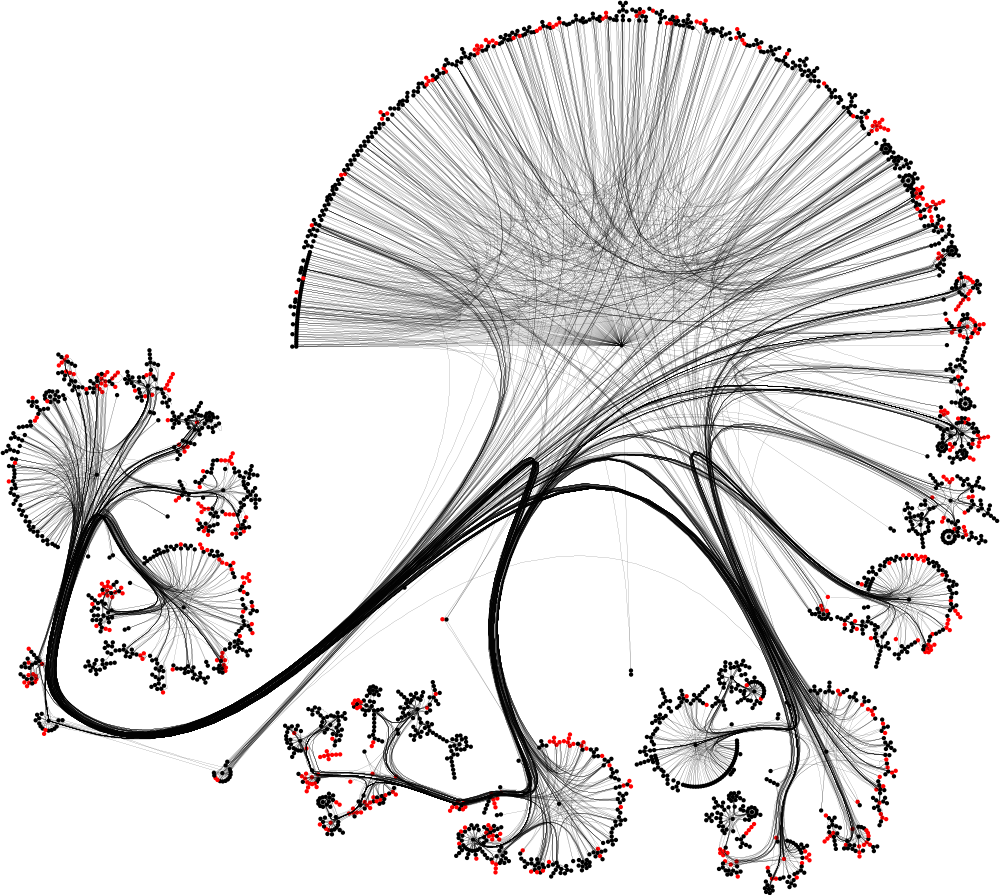
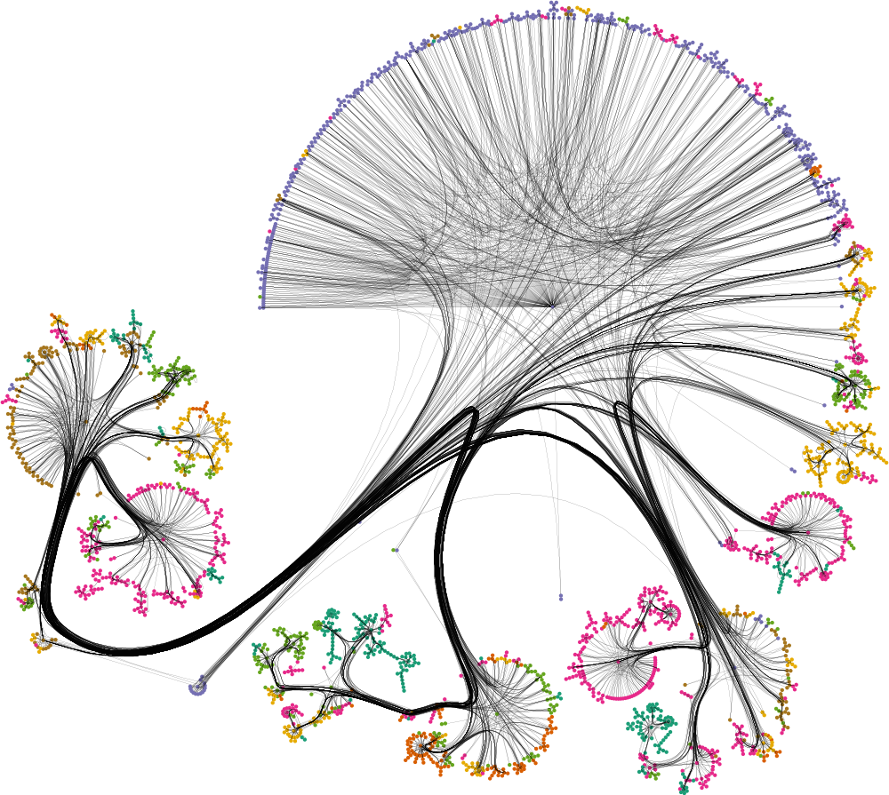

# Matern Gaussian Processes on Graphs


<div>
  
  
  
</div>

This repo provides an extension for [`gpflow`](https://www.gpflow.org/) with Matérn kernels, inducing variables and trainable models implemented for graphs. 
Easily integrated with the rest of `gpflow` functionality, it allows one to run GP regression and classification problems on graphs.
See `examples` notebooks and docstrings for how-to guides/documentation.


## Installation
Minimal installation is performed by typing 
> pip install -e .

in your terminal inside the cloned repo directory.

To run example notebooks, install the dependencies with
> pip install -e .[examples]

On Windows, we recommend using Windows Subsystem for Linux (WSL).

## Library usage
A rough outline of how to use the library is as follows:
```python
>>> from graph_matern.kernels.graph_matern_kernel import GraphMaternKernel
>>> laplacian = nx.laplacian_matrix(G)  # G is a networkx Graph
>>> eigenvalues, eigenvectors = tf.linalg.eigh(laplacian)  # only should be done once-per-graph
>>> kernel = GraphMaternKernel((eigenvectors, eigenvalues))
>>> model = gpflow.models.GPR(data=data, kernel=kernel)
```
Note that one is not constrained to use `GPR` as a model, check out our example notebooks for a more detailed how-to.

## Examples

Notebook with topic classification for citation networks on the `CORA` dataset [[1]](https://graphsandnetworks.com/the-cora-dataset/) is
> jupyter notebook examples/classification.ipynb

Notebook with primitive regression on PEMS data [[2]](https://github.com/VeritasYin/STGCN_IJCAI-18/blob/master/data_loader/PeMS-M.zip) is
> jupyter notebook  examples/regression.ipynb 

The data in `examples/data` is third-party, and only provided in the repo to facilitate running the examples. 

## Citation
```
@inproceedings{borovitskiy2021matern,
      title={Matern Gaussian Processes on Graphs}, 
      author={Viacheslav Borovitskiy and Iskander Azangulov and Alexander Terenin and Peter Mostowsky and Marc Peter Deisenroth and Nicolas Durrande},
      booktitle={International Conference on Artificial Intelligence and Statistics},
      year={2021},
      organization={PMLR}
}
```
